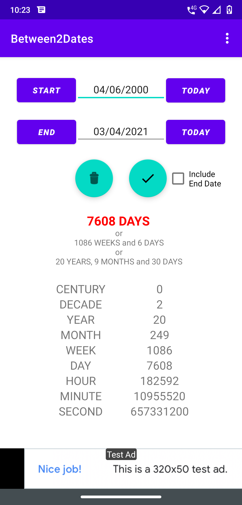

# Between2Dates
This application calculate differnce between two dates,
Which can be entered manually or selected from the START and END button or selected with the TODAY button. 
Output given in terms of days, weeks, years, hours etc.
Also, the simple interface allows user to easily and quickly use the app.

Features:
- calculates the days between two dates
- duration is shown in days and/or in weeks + days and/or in years + months + days etc.
- date can be entered manually or selected from the START and END button or selected with the TODAY button. 
- option to include or exclude end date

 
